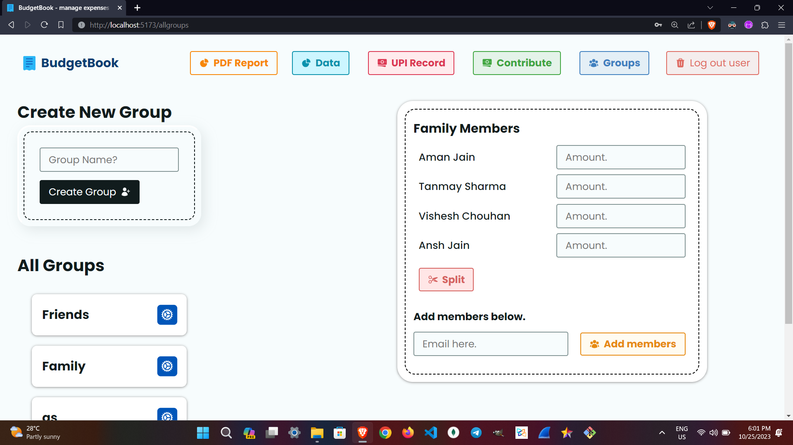
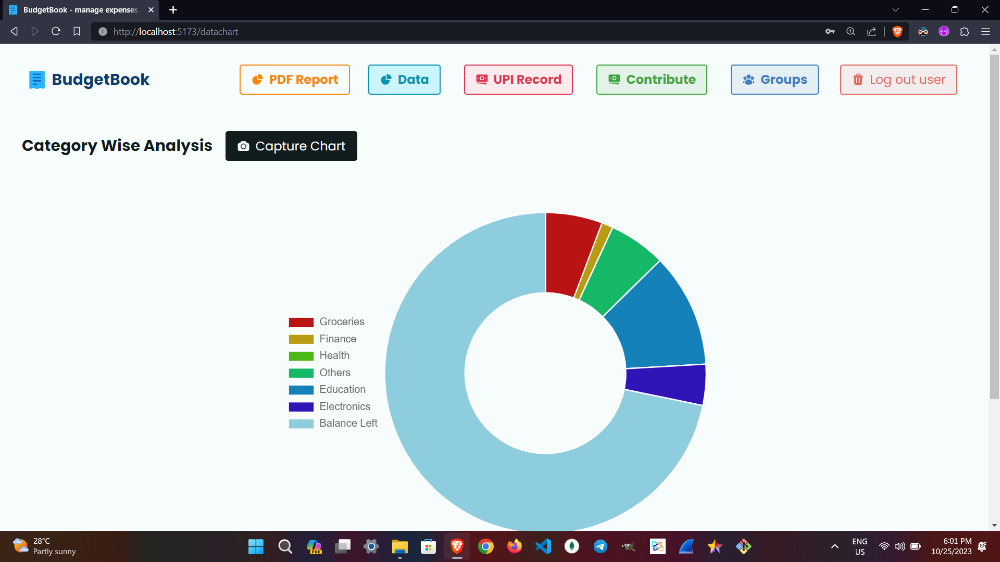
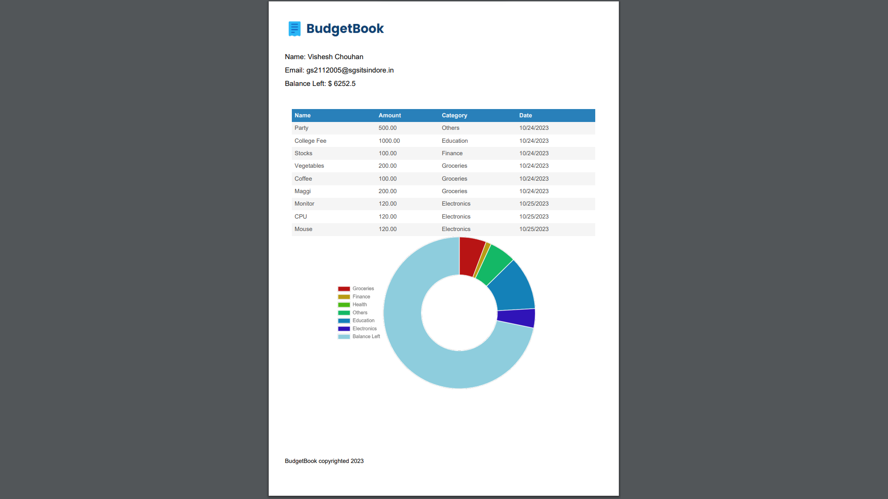

# BudgetBook Application

This is BudgetBook, our college project (5th sem). It is an expense tracker website. You can view [screenshots](https://github.com/tookstanmay/expense-tracker-v3/tree/master/screenshots) and proceed.
Happy Coding!

## Technologies Used

BudgetBook is built using the following technologies:

- React JS: A powerful JavaScript library for building user interfaces.
- react-toastify: Used for displaying user-friendly alerts and notifications.
- HTML: Markup language for structuring the application's content.
- CSS: Styling language to make the application visually appealing.
- JavaScript: Programming language for interactive and dynamic functionality.
- jspdf: Exporting the expense data into PDF and download the pdf.
- react-chartjs-2 and chart.js: data visualization into Doughnut format.
- firebase: fetch UPI transactions from firebase app, which can read data and send it to firebase ( credit/ debit amount )
- POSTGRESQL: store user data

## Features

- **User Accounts:** Create an account using your username. Account data is stored in the browser's localStorage for easy access.
- **Budget Creation:** Create budgets tailored to your financial needs. Set budget limits to keep your spending in check.
- **Expense Management:** Add expenses to your budgets to keep track of your spending.
- **Export Reports:** View detailed reports categorizing your expenses. Export your expenses into PDF format.
- **Recent Expenses:** Stay informed about your most recent expenses for better financial awareness.
- **Deletion Options:** Delete expenses and budgets as needed. You can also delete your user account if desired.
- **Data Visualization:** View category wise expenses in Doughnut chart.
- **Group Creation:** Create Groups and split amount among members.
- **Contribution:** Send money to other registered users.
- **Low Balance Notifications**.
  
## Future References for Web App: 

-**DEPLOYMENT TO SERVER**

## Getting Started

1. Clone the repository: `git clone https://github.com/tookstanmay/expense-tracker-v3/`
2. Navigate to the project directory: `cd expense-tracker-v3/`
3. For this project We've used Vite server.
4. Install dependencies: `npm install`
5. Start the development server (remember we're using concurrently here): `npm run both`
6. Access the application in your browser at `http://localhost:5173/register`

## Usage

1. Create an account using your preferred username.
2. Start by creating categories and setting categories limits.
3. Add expenses to your categories to keep track of your spending.
4. Explore the expense reports to gain insights into your financial habits.
5. Manage your recent expenses and consider adjusting your budget strategy.
6. Feel free to delete expenses, categories, or even your user account if needed.

## Contribution

If you'd like to contribute to the BudgetBook Application, please follow these steps:

1. Fork the repository.
2. Create a new branch for your feature: `git checkout -b feature-new-feature`
3. Make your changes and commit them: `git commit -m 'Add some feature'`
4. Push to the branch: `git push origin feature-new-feature`
5. Submit a pull request detailing your changes.

## Feedback

We welcome your feedback on the BudgetBook Application. If you have any suggestions, improvements, or bug reports, please feel free to create an issue on the GitHub repository.

Enjoy using the BudgetBook Application to manage your finances effectively!

## Thank You Contributors

We'd like to thank all the contributors of our project:
- [Vishesh Chouhan](https://github.com/VisheshChouhan)
- [Ruchi Jamre](https://github.com/Ruchi12390)
- [Ansh Jain](https://github.com/AnshJain2033)
- [Tanmay Sharma](https://github.com/tookstanmay) (host)

  Also We'd like to thank Chris Pennington ([Coding in Public](https://github.com/coding-in-public)) for the inspiration of this theme. Hey Chris! we took this forward from localStorage to SQL with additional features! 🥳🥳

## Some Screenshots
 

 

 

